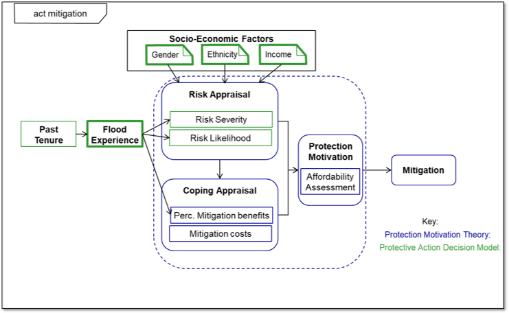

# Sea Bright, New Jersey Reconstructed: Agent-Based Protection Theory Model Responses to Hurricane Sandy

Copy of the code and ODD oringally uploaded to <https://www.comses.net/codebase-release/79a5e637-efb4-40e7-8d22-9e4a41f01341/>
 

## Abstract:

"Coastal flooding is the most expensive type of natural disaster in the United States. Policy initiatives to mitigate the effects of these events are dependent upon understanding flood victim responses at an individual and municipal level. Agent-Based Modeling (ABM) is an effective tool for analyzing community-wide responses to natural disaster, but the quality of the ABM’s performance is often challenging to determine. This paper discusses the complexity of the Protective Action Decision Model (PADM) and Protection Motivation Theory (PMT) for human decision making regarding hazard mitigations. A combined (PADM/PMT) model is developed and integrated into the MASON modeling framework. The ABM implements a hind-cast of Hurricane Sandy’s damage to Sea Bright, NJ and homeowner post-flood reconstruction decisions. It is validated against damage assessments and post-storm surveys. The contribution of socio-economic factors and built environment on model performance is also addressed and suggests that mitigation for townhouse communities will be challenging."
 
 
 
## Reference
 
* **McEligot, K. Brouse, P.  and Crooks A.T. (2019)**, Sea Bright, New Jersey Reconstructed: Agent-Based Protection Theory Model Responses to Hurricane Sandy, in Mustafee, N., Bae, K.-H.G., Lazarova-Molnar, S., Rabe, M., Szabo, C., Haas, P. and Son, Y-J. (eds.), Proceedings of the 2019 Winter Simulation Conference, National Harbor, MD, pp 251-262 [(pdf)](https://www.dropbox.com/s/jjxuaadftw9jztg/SEA_BRIGHT_Wintersim.pdf?dl=0)

## Example Simulation Run

Click on Image to see a simulation run. 

## Whats in this Repository? 
* MASON Code
* [Paper](SEA_BRIGHT_Wintersim.pdf)
* [Overview, Design concepts, and Details (ODD) Document](SeaBrightODD.pdf)

## What is Needed to Run the Model?
MASON
The model source code (utilizing MASON Version 17) and

